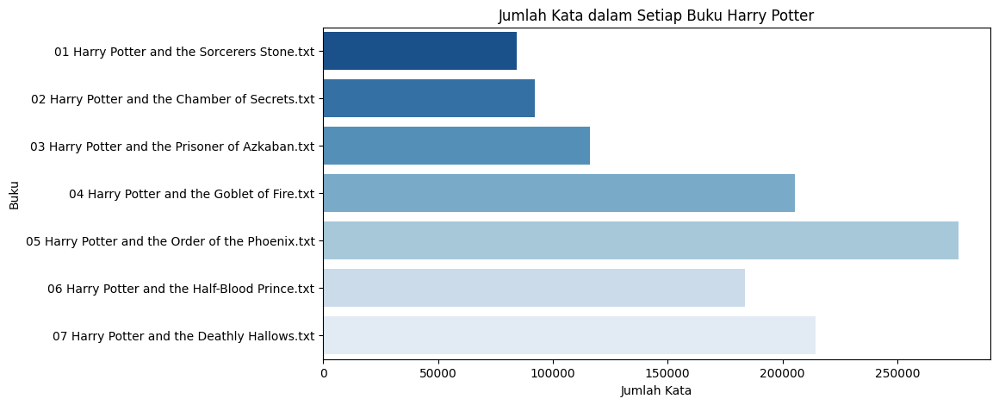
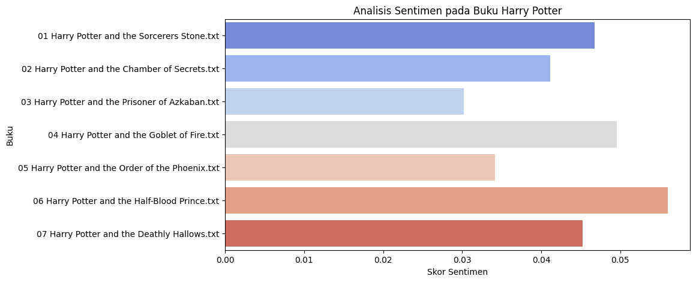

## Untuk menjalankan code, berada di repository dengan nama harrypotter.ipynb ##

``` python
import os
import json
import re
import pandas as pd
import matplotlib.pyplot as plt
import seaborn as sns
from textblob import TextBlob
from collections import Counter
import nltk
from nltk.corpus import stopwords

nltk.download("stopwords")

# 1️⃣ Folder berisi file Harry Potter .txt
folder_path = "D:/me!/College/SEMESTER 6/DIP/Tugas 1/archive/"

# Ambil semua file .txt di dalam folder
txt_files = [f for f in os.listdir(folder_path) if f.endswith(".txt")]

# Dictionary untuk menyimpan hasil
all_books = {}
```

``` python
# 2️⃣ Fungsi untuk membersihkan teks
def clean_text(text):
    # Hilangkan karakter newline dan carriage return
    text = text.replace("\n", " ").replace("\r", " ")

    # Hilangkan teks yang tidak diperlukan (misal: "Chapter 1", "Page 23", dll.)
    text = re.sub(r"\b(chapter|page|book)\s*\d*\b", "", text, flags=re.IGNORECASE)

    # Hilangkan karakter spesial kecuali [. ! ?]
    text = re.sub(r"[^a-zA-Z0-9.!? ]", "", text)

    # Tambahkan spasi sebelum karakter spesial [. ! ?]
    text = re.sub(r"([.!?])", r" \1", text)

    # Perbaiki kata yang memiliki karakter [. ! ?] di tempat yang tidak sesuai
    text = re.sub(r"\s+([.!?])", r" \1", text)  # Jika ada spasi sebelum karakter
    text = re.sub(r"([.!?])\s+", r"\1 ", text)  # Jika ada spasi setelah karakter

    # Hapus spasi berlebih
    text = re.sub(r"\s+", " ", text).strip()

    return text
print(f"✅ {len(all_books)} file Harry Potter sudah di proses sesuai aturan!")
```

::: {.output .stream .stdout}
    ✅ 7 file Harry Potter sudah di proses sesuai aturan!

``` python
# 3️⃣ Proses setiap file dan simpan hasilnya
for file in txt_files:
    with open(os.path.join(folder_path, file), "r", encoding="utf-8") as f:
        content = f.read()

    # Bersihkan teks
    cleaned_text = clean_text(content)

    # Simpan hasilnya dalam dictionary
    all_books[file] = cleaned_text

# Simpan ke file JSON
json_path = "harry_potter_books_cleaned.json"
with open(json_path, "w", encoding="utf-8") as json_file:
    json.dump(all_books, json_file, ensure_ascii=False, indent=4)

print(f"✅ {len(all_books)} file Harry Potter diproses dan disimpan dalam JSON!")
```

::: {.output .stream .stdout}
    ✅ 7 file Harry Potter diproses dan disimpan dalam JSON!

``` python
# 4️⃣ 🔹 Membaca kembali JSON dan membuat DataFrame Pandas
with open(json_path, "r", encoding="utf-8") as json_file:
    books_data = json.load(json_file)

# Konversi ke DataFrame
df = pd.DataFrame(list(books_data.items()), columns=["Book", "Content"])


# Tampilkan DataFrame dalam bentuk tabel
display(df)
```


``` python
# 5️⃣ 🔹 Visualisasi jumlah kata per buku + Tampilkan tabel jumlah kata

# Tampilkan tabel jumlah kata
word_count_df = df[["Book", "Word Count"]]
display(word_count_df)  # Menampilkan tabel jumlah kata

# Grafik batang jumlah kata per buku
plt.figure(figsize=(10, 5))
sns.barplot(x="Word Count", y="Book", data=df, palette="Blues_r")
plt.xlabel("Jumlah Kata")
plt.ylabel("Buku")
plt.title("Jumlah Kata dalam Setiap Buku Harry Potter")
plt.show()
```


::: {.output .display_data}



::: {.cell .code execution_count="34"}
``` python
# 6️⃣ 🔹 Analisis Sentimen
def analyze_sentiment(text):
    analysis = TextBlob(text)
    return analysis.sentiment.polarity  # Skala -1 (negatif) hingga 1 (positif)

df["Sentiment Score"] = df["Content"].apply(analyze_sentiment)

# Visualisasi Sentimen
plt.figure(figsize=(10, 5))
sns.barplot(x="Sentiment Score", y="Book", data=df, palette="coolwarm")
plt.xlabel("Skor Sentimen")
plt.ylabel("Buku")
plt.title("Analisis Sentimen pada Buku Harry Potter")
plt.show()
```


::: {.output .display_data}



``` python
# 7️⃣ 🔹 Analisis Kata yang Sering Muncul (Tanpa Word Cloud)
stop_words = set(stopwords.words("english"))

def get_most_common_words(text, n=20):
    words = text.lower().split()
    words = [word for word in words if word not in stop_words and word.isalpha()]
    return Counter(words).most_common(n)

# Hitung kata paling sering muncul di seluruh buku
all_text = " ".join(df["Content"])
most_common_words = get_most_common_words(all_text)

# Buat DataFrame untuk tabel kata yang sering muncul
word_freq_df = pd.DataFrame(most_common_words, columns=["Word", "Frequency"])

# Tampilkan tabel kata yang sering muncul
display(word_freq_df)
```


